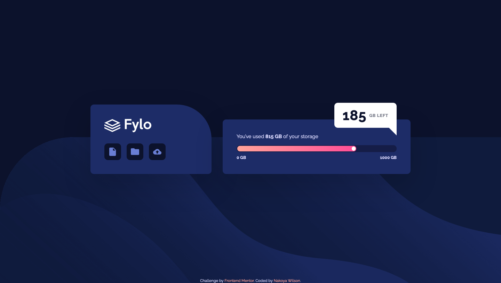

# Frontend Mentor - Fylo data storage component solution

This is a solution to the [Fylo data storage component challenge on Frontend Mentor](https://www.frontendmentor.io/challenges/fylo-data-storage-component-1dZPRbV5n). Frontend Mentor challenges help you improve your coding skills by building realistic projects.

## Table of contents

- [Overview](#overview)
  - [The challenge](#the-challenge)
  - [Screenshot](#screenshot)
  - [Links](#links)
- [My process](#my-process)
  - [Built with](#built-with)
  - [Useful resources](#useful-resources)
- [Author](#author)

## Overview

### The challenge

Users should be able to:

- View the optimal layout for the site depending on their device's screen size

### Screenshot

### Links

- Solution URL: [https://www.frontendmentor.io/solutions/fylo-data-storage-component-using-flexbox-and-css-grid-8hYeDtiRS](https://www.frontendmentor.io/solutions/fylo-data-storage-component-using-flexbox-and-css-grid-8hYeDtiRS)
- Live Site URL: [https://nakoyawilson.github.io/fylo-data-storage-component/](https://nakoyawilson.github.io/fylo-data-storage-component/)

## My process

### Built with

- HTML
- CSS
- Flexbox
- CSS Grid

### Useful resources

- [The Shapes of CSS](https://css-tricks.com/the-shapes-of-css/) - This website was helpful for making the triangle with CSS.

## Author

- Website - [Nakoya Wilson](https://nakoyawilson.netlify.app/)
- Frontend Mentor - [@nakoyawilson](https://www.frontendmentor.io/profile/nakoyawilson)
- Twitter - [@nakoyawilson](https://twitter.com/nakoyawilson)
- LinkedIn - [@nakoyawilson](https://www.linkedin.com/in/nakoyawilson/)
